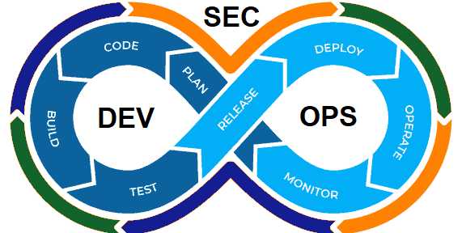

## Parte 3: Automatización y Prácticas de Seguridad

- ### Automatización de pruebas de seguridad, análisis estático y dinámico de código. .

La automatización de DevOps consiste en incorporar las tecnologías que ejecutan tareas con poca intervención humana en los procesos que facilitan los ciclos de retroalimentación entre los equipos de operaciones y los de desarrollo, para implementar las actualizaciones constantes de las aplicaciones en la producción con mayor rapidez.

  
 
  **Referencias:**
  -	Hat, R. (8 de Enero de 2019). [¿Qué es la automatización de DevOps?](https://www.redhat.com/es/topics/automation/what-is-devops-automation#:~:text=La%20automatizaci%C3%B3n%20de%20DevOps%20consiste,aplicaciones%20en%20la%20producci%C3%B3n%20con)

- ### Integración de escaneo de vulnerabilidades y pruebas de penetración.

Al integrar y automatizar la seguridad, el proceso manual de prueba de seguridad de aplicaciones se escala para proporcionar un mayor impulso en el entorno de desarrollo de software y durante todo el ciclo de vida de la implementación.

Eso significa que DevSecOps brinda a los equipos de operaciones y desarrollo de aplicaciones la libertad de ser innovadores y libres de obstáculos en los entornos ágiles de hoy en día, y la entrega de software es más rápida. Esta detección y respuesta más eficientes a las vulnerabilidades del software en producción ofrece ahorros de costos. Se trata de aprovechar DevSecOps para ofrecer software más seguro y de alta calidad más rápido.

  

 **Referencias:**
  -	Parasoft. (2023). [Integración y automatización de la seguridad](https://es.parasoft.com/solutions/devsecops/)

- ### Implementación de prácticas de revisión de seguridad en cada etapa del desarrollo.

mplementar DevSecOps es desplazar la seguridad hacia la izquierda. Es integrarla en el proceso de desarrollo tecnológico antes de que aparezca la primera línea de código. Adoptar DevSecOps es introducir en el SDLC requisitos y pruebas de seguridad, priorización y remediación de vulnerabilidades y seguimiento riguroso para la prevención de riesgos y el ahorro de costos. A diferencia de las metodologías anteriores, la identificación y corrección de los problemas de seguridad se producen al mismo tiempo que la actividad de desarrollo, sin esperar al final de cada ciclo. En DevSecOps, la seguridad actúa en la planificación, diseño, construcción, pruebas y lanzamiento del software, proporcionando retroalimentación continua a todos los equipos comprometidos.

  

 **Referencias:**
  -	Ruz, Felipe. (2022). [Implementación de DevSecOps](https://fluidattacks.com/es/blog/como-implementar-devsecops/)

- ### Uso de contenedores seguros y orquestación. 

Los contenedores son una forma de virtualización del sistema operativo. Un solo contenedor se puede usar para ejecutar cualquier cosa, desde un microservicio o un proceso de software a una aplicación de mayor tamaño. Dentro de un contenedor se encuentran todos los ejecutables, el código binario, las bibliotecas y los archivos de configuración necesarios. Sin embargo, en comparación con los métodos de virtualización de máquinas o servidores, los contenedores no contienen imágenes del sistema operativo. Esto los hace más ligeros y portátiles, con una sobrecarga significativamente menor. En implementaciones de aplicaciones de mayor tamaño, se pueden poner en marcha varios contenedores como uno o varios clústeres de contenedores.

  

 **Referencias:**
  -	NetApp. (2023). [¿Qué son los contenedores?](https://www.netapp.com/es/devops-solutions/what-are-containers/#:~:text=Los%20contenedores%20permiten%20poner%20en,las%20aplicaciones%20con%20mayor%20rapidez.&text=Los%20contenedores%20respaldan%20los%20esfuerzos,de%20desarrollo%2C%20prueba%20y%20producci%C3%B3n.)
