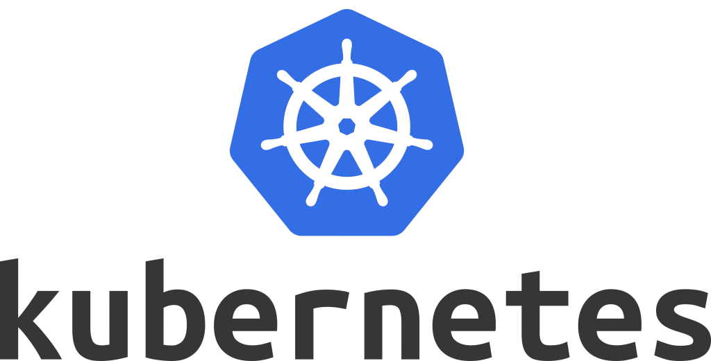
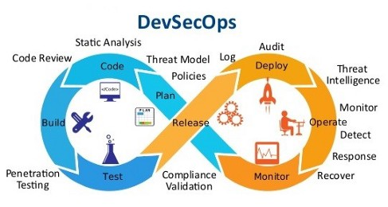
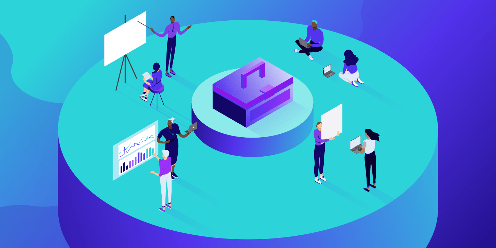
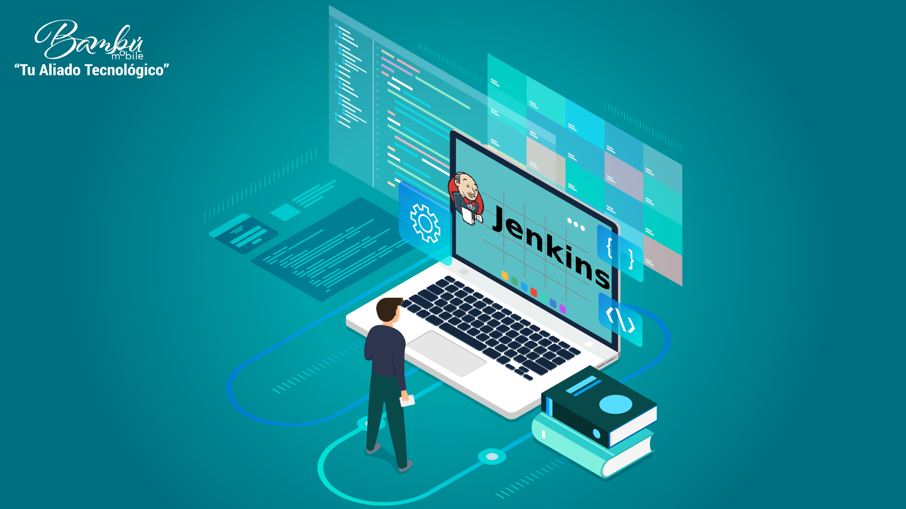

## Parte 2: Integración de Desarrollo, Seguridad y Operaciones

- ### Colaboración entre equipos de desarrollo, seguridad y operaciones.
  
  DevSecOps es un marco de trabajo que integra las prácticas de seguridad en el ciclo de vida del desarrollo de software. Este marco promueve la colaboración entre los equipos de desarrollo, seguridad y operaciones, lo que permite la entrega continua de software de alta calidad con seguridad integrada (Owasp, 2021).

  En un entorno DevSecOps, los equipos de desarrollo, seguridad y operaciones trabajan juntos desde el principio del ciclo de vida del desarrollo de software. Esta colaboración permite que los problemas de seguridad se identifiquen y se resuelvan más rápidamente, lo que reduce el tiempo de lanzamiento al mercado y mejora la calidad del software (IBM, 2020).

  **Referencias:**
  - Owasp. (2021). [DevSecOps](https://owasp.org/www-project-devsecops-maturity-model/)
  - IBM. (2020). [What is DevSecOps?](https://www.ibm.com/cloud/learn/devsecops)

- ### Herramientas y tecnologías que respaldan la integración de DevSecOps.
  Existen varias herramientas y tecnologías que respaldan la integración de DevSecOps, incluyendo:

  - **Docker:**
  Docker es una plataforma de software que permite la creación, prueba y despliegue de aplicaciones rápidamente a través de contenedores (Docker, 2021).

  
    
  - **Jenkins:**
  Jenkins es una herramienta de integración continua que permite a los equipos de desarrollo, seguridad y operaciones colaborar eficazmente (Jenkins, 2021).

  
  
  - **Kubernetes:**
  Kubernetes es una plataforma de código abierto para la automatización del despliegue, escalado y administración de aplicaciones en contenedores (Kubernetes, 2021).

  
  
  - **SonarQube:**
  SonarQube es una herramienta de código abierto para la gestión de la calidad del código que admite más de 20 lenguajes de programación (SonarQube, 2021).

  

  **Referencias:**
  - Docker. (2021). [What is a Container?](https://www.docker.com/resources/what-container)
  - Jenkins. (2021). [What is Jenkins?](https://www.jenkins.io/doc/book/using/)
  - Kubernetes. (2021). [What is Kubernetes?](https://kubernetes.io/docs/concepts/overview/what-is-kubernetes/)
  - SonarQube. (2021). [Clean as You Code](https://www.sonarqube.org/features/clean-as-you-code/)

- ### Ciclo de vida de desarrollo en un entorno DevSecOps.

  
  
  El ciclo de vida de desarrollo en un entorno DevSecOps incluye las siguientes etapas:

  - **Planificación y Análisis:** En esta etapa, los equipos de desarrollo, seguridad y operaciones colaboran para definir los requerimientos del software y planificar su desarrollo.
  - **Diseño:** Se diseña la arquitectura del software teniendo en cuenta los requerimientos de seguridad.
  - **Desarrollo:** Los equipos de desarrollo y seguridad trabajan juntos para desarrollar el software, implementando prácticas de seguridad desde el inicio.
  - **Pruebas:** Se realizan pruebas de seguridad continuas durante todo el ciclo de vida del desarrollo.
  - **Despliegue:** Se implementa el software en el entorno de producción, asegurándose de que cumple con los estándares de seguridad.
  - **Operaciones y Monitoreo:** Se monitorea continuamente el software en producción para detectar y resolver problemas de seguridad (Red Hat, 2021).

  **Referencias:**
  - Red Hat. (2021). [What is DevSecOps?](https://www.redhat.com/en/topics/devops/what-is-devsecops)

- ### Ejemplos de flujos de trabajo y prácticas colaborativas.
  
  - Los equipos de desarrollo, seguridad y operaciones colaboran para definir los requerimientos del software.

    

  - El equipo de desarrollo comienza a desarrollar el software, usando herramientas como Docker y Jenkins para automatizar el proceso.

    

  - El equipo de seguridad realiza pruebas de seguridad continuas durante todo el ciclo de vida del desarrollo, usando herramientas como SonarQube.

    

  - Una vez que el software está listo, se despliega en el entorno de producción.

    

  - El equipo de operaciones monitorea continuamente el software en producción, trabajando con los equipos de desarrollo y seguridad para resolver cualquier problema que pueda surgir (IBM, 2020).

    

  Una práctica colaborativa común en un entorno DevSecOps es la integración continua. Esta práctica implica que los desarrolladores integren su trabajo con frecuencia, lo que permite detectar y resolver problemas más rápidamente. Otra práctica colaborativa es la entrega continua, que implica desplegar todas las actualizaciones de software que pasen las pruebas de seguridad (Atlassian, 2021).

  **Referencias:**
  - IBM. (2020). [What is DevSecOps?](https://www.ibm.com/cloud/learn/devsecops)
  - Atlassian. (2021). [What is DevOps?](https://www.atlassian.com/devops)
