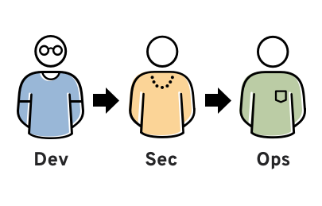
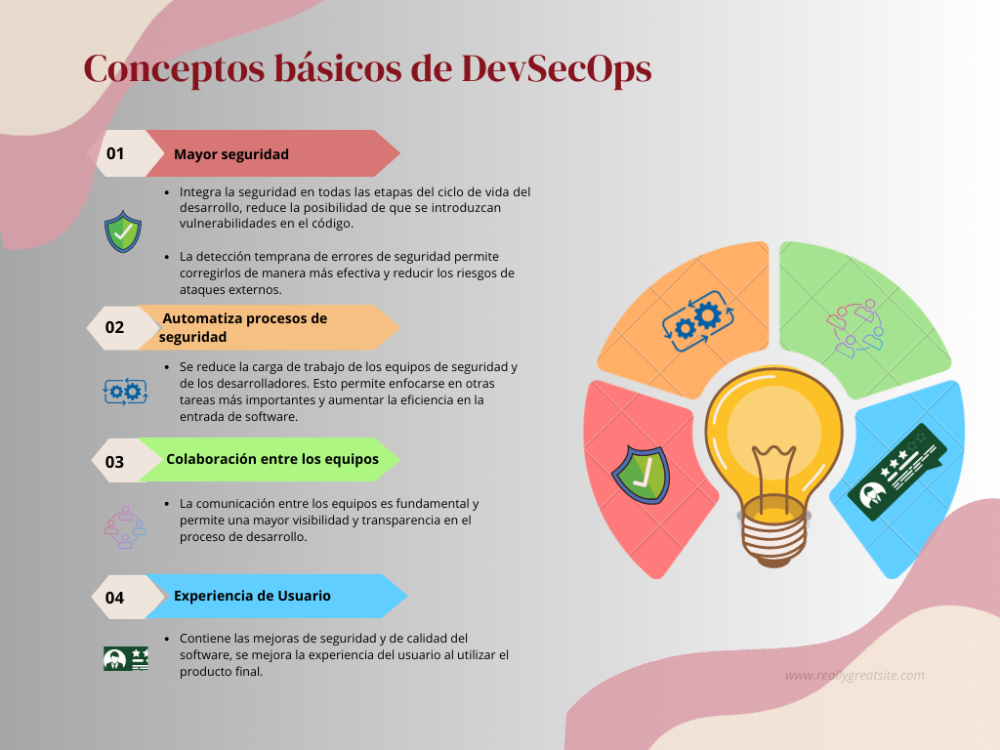

## Parte 1: Introducción a DevSecOps

- ### Definición y conceptos básicos de DevSecOps.
  
  DevSecOps significa desarrollo, seguridad y operaciones. Se trata de un enfoque que aborda la cultura, la automatización y el diseño de plataformas, e integra la seguridad como una responsabilidad compartida durante todo el ciclo de vida de la TI. (Redhat, 2023).
  
  
- ### Conceptos básicos de DevSecOps.
  

  **Referencias:**
  - Redhat. (2023). [DevSecOps](https://www.redhat.com/es/topics/devops/what-is-devsecops)
  - Sentrio Labs S.L. 2022.  [Conceptos básicos DevSecOps](https://sentrio.io/blog/conceptos-fundamentales-en-devsecops/#Principales_conceptos_de_DevSecOps)

- ### Importancia de integrar seguridad desde el principio.

  Al integrar seguridad desde el inicio permite a los desarrolladores herramientas necesarias para generar software seguro confiable, determinar la tolerancia a los riesgos y realizar un análisis de riesgos y beneficios al respecto.
  
  

  
  
  

  **Referencias:**
  - Redhat. (2023). [La seguridad de DevOps](hhttps://www.redhat.com/es/topics/devops/what-is-devsecops#seguridad-integrada)
 
 

- ### Beneficios y objetivos de implementar DevSecOps.

  Entre los objetivos de DevSecOps se encuentran:
  
 - **lanzar mejor software más rápido**  
 
 - **detectar y responder a fallas de software en producción de manera más rápida y eficiente**  
   
  "El propósito y la intención de DevSecOps es crear sobre la mentalidad de que todo el mundo es responsable por la seguridad, con el objetivo de distribuir de manera segura las decisiones de seguridad rápidamente y escalar para aquellos que mantienen el nivel más alto de contexto, sin sacrificar la seguridad necesaria", describe Shannon Lietz, coautora del manifiesto "DevSecOps Manifiest".
   
   **Referencias:**
  - IBM. (2020). [Ventajas DevSecOps?](https://www.ibm.com/mx-es/topics/devsecops)
